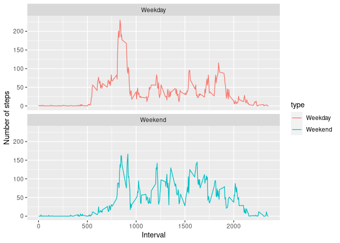

## 1. Code for reading in the dataset and/or processing the data


```r
# Load the data
df <- read.csv('activity.csv')
# Process/transform the data
str(df)
```

```
## 'data.frame':	17568 obs. of  3 variables:
##  $ steps   : int  NA NA NA NA NA NA NA NA NA NA ...
##  $ date    : chr  "2012-10-01" "2012-10-01" "2012-10-01" "2012-10-01" ...
##  $ interval: int  0 5 10 15 20 25 30 35 40 45 ...
```

```r
df$date <- as.Date(df$date) # covert as date
str(df)
```

```
## 'data.frame':	17568 obs. of  3 variables:
##  $ steps   : int  NA NA NA NA NA NA NA NA NA NA ...
##  $ date    : Date, format: "2012-10-01" "2012-10-01" ...
##  $ interval: int  0 5 10 15 20 25 30 35 40 45 ...
```


## 2. Histogram of the total number of steps taken each day


```r
# Calculate the total number of steps taken per day
df_steps <- with(df, aggregate(steps, by = list(date), FUN = sum, na.rm = TRUE))
names(df_steps) <- c("date", "steps")
# Make a histogram of the total number of steps taken each day
hist(df_steps$steps, main = "Histogram of the total number of steps taken each day", xlab = "Total number of steps taken each day", ylab = "Frequency")
```

<!-- -->


## 3. Mean and median number of steps taken each day


```r
# Calculate and report the mean and median of the total number of steps taken per day
mean_steps <- mean(df_steps$steps, na.rm = TRUE)
print(paste0("Mean number of steps taken each day = ", mean_steps))
```

```
## [1] "Mean number of steps taken each day = 9354.22950819672"
```

```r
median_steps <- median(df_steps$steps, na.rm = TRUE)
print(paste0("Median number of steps taken each day = ", median_steps))
```

```
## [1] "Median number of steps taken each day = 10395"
```

## 4. Time series plot of the average number of steps taken


```r
# Calculate the average daily activity pattern
df_activity <- with(df, aggregate(steps, by = list(interval), FUN = mean, na.rm = TRUE))
names(df_activity) <- c("interval", "steps")
# Make a time series plot
plot(df_activity$interval, df_activity$steps, type = "l", xlab="The 5-minute interval", ylab="The average number of steps", main="Time series plot of the average number of steps taken")
```

<!-- -->


## 5. The 5-minute interval that, on average, contains the maximum number of steps


```r
# Find out the maximum number of steps
df_activity[which.max(df_activity$steps),]
```

```
##     interval    steps
## 104      835 206.1698
```


## 6. Code to describe and show a strategy for imputing missing data

```r
# Calculate and report the total number of missing values
print(paste0("The total number of missing values = ", sum(is.na(df$steps))))
```

```
## [1] "The total number of missing values = 2304"
```

```r
# Filling in all of the missing values with the average number of steps in the same 5-min interval
df_fill <- df # Create a new dataset
step_na <- is.na(df_fill$steps)
avg_na <- tapply(df_fill$steps, df_fill$interval, mean, na.rm=TRUE, simplify=TRUE)
df_fill$steps[step_na] <- avg_na[as.character(df_fill$interval[step_na])]
```

```r
# Make a histogram of the total number of steps taken each day after imputing missing values
df_steps <- with(df_fill, aggregate(steps, by = list(date), FUN = sum))
names(df_steps) <- c("date", "steps")
hist(df_steps$steps, main = "Histogram after imputing missing values", xlab = "Total number of steps taken each day", ylab = "Frequency")
```

<!-- -->

```r
# Report the mean and median total number of steps taken per day after imputing missing values
print(paste0("Mean number of steps after imputing missing values = ", mean(df_steps$steps)))
```

```
## [1] "Mean number of steps after imputing missing values = 10766.1886792453"
```

```r
print(paste0("Median number of steps after imputing missing values = ", median(df_steps$steps)))
```

```
## [1] "Median number of steps after imputing missing values = 10766.1886792453"
```

```r
# Do these values differ from the estimates from the first part of the assignment?
print(paste0("Difference: ", "The Mean and Median number of steps are higher after imputing missing values than before imputing missing values."))
```

```
## [1] "Difference: The Mean and Median number of steps are higher after imputing missing values than before imputing missing values."
```

```r
# What is the impact of imputing missing data on the estimates of the total daily number of steps?
print(paste0("Impact:  ", "Both the Mean and Median number of steps are now equals for imputing missing values."))
```

```
## [1] "Impact:  Both the Mean and Median number of steps are now equals for imputing missing values."
```


## 7 Are there differences in activity patterns between weekdays and weekends?


```r
# Indicating whether a given date is a weekday or weekend day
df_fill$type <- sapply(df_fill$date, function(x) {
  if(weekdays(x) == "Saturday" | weekdays(x) == "Sunday") {
    y <- "Weekend"
  } else {
    y <- "Weekday"
  }
  y
})
# Make a panel plot containing a time series plot
library(ggplot2)
df_type <- aggregate(steps~interval + type, df_fill, mean)
ggplot(df_type, aes(x = interval , y = steps, color = type)) + geom_line() + labs(x = "Interval", y = "Number of steps") + facet_wrap(~type, ncol = 1, nrow=2)
```

<!-- -->

```r
# Differences in activity patterns between weekdays and weekends?
print(paste0("Difference: ", "The activity seems to be higher over weekends than over weekdays in most of the cases."))
```

```
## [1] "Difference: The activity seems to be higher over weekends than over weekdays in most of the cases."
```
